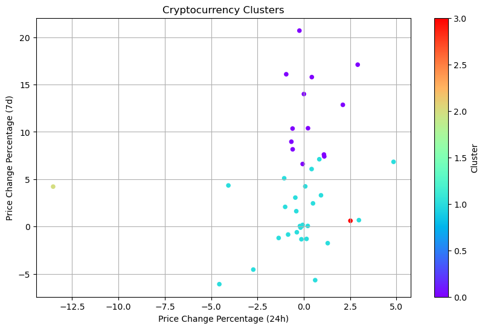
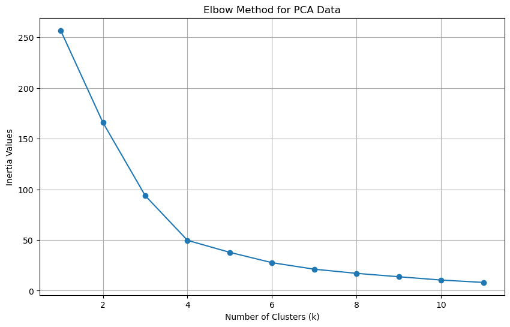
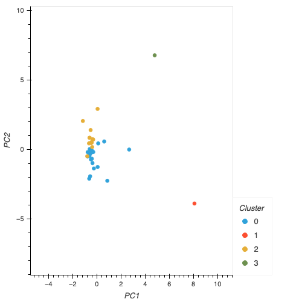

# Crypto Clustering using K-Means and PCA

This project involves clustering cryptocurrencies based on their market data using K-Means clustering and Principal Component Analysis (PCA). The goal is to group similar cryptocurrencies together based on their price change percfentages over different time periods. 

## Table of Contents
* Introduction
* Installation
* Usage 
* Results

### Introduction
Cryptocurrencies are known for their volatile nature and understanding their behavior is challening. This project aims to analyze and cluster cryptocurrencies based on their market data, specifically focusing on price change percentages over different time intervals (24 hours, 7 days, etc.). The clustering is performed using K-Means, a popular unsupervised learning algorithm, and the dimensionality of the data is reduced using PCA to improve computational efficiency and interpretability.

### Installation
1. Clone the repository:
`git clone https://github.com/jdanielle12/CryptoClustering`
2. Navigate to the project directory:
`cd CryptoClustering`
3. Install the required dependencies:
`pip install -r requirements.txt`

### Usage
1. Ensure that you have installed all dependencies as mentioned in the Installation section.
2. Open the `Crypto_Clustering.ipynb` file.
3. Execute each cell in the notebook to perform clustering and analysis.
4. Follow the instructions within the notebook to analyze the results.

### Results
Include visual representations of the results here, such as plots of the clustered data or PCA analysis. Below are examples of the results:

### Example 1: Clustering Results

### Example 2: PCA Analysis

### Example 3: HvPlot

